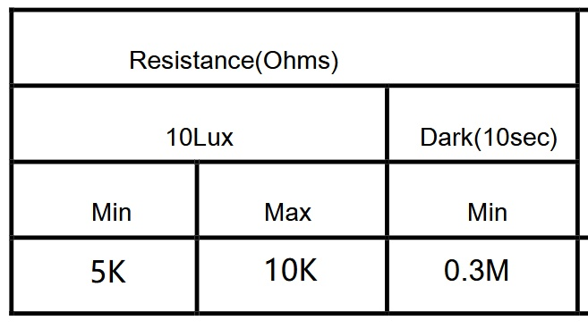
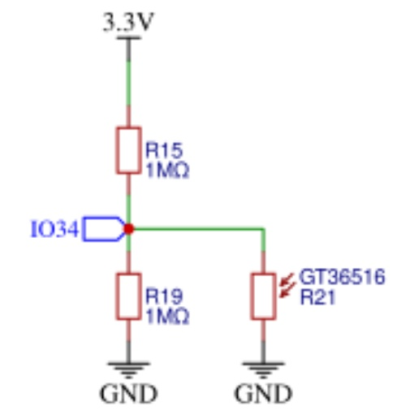

# NOTE
- LDR on CYD 3.5inch is GT36516
- Because of the schematic (the R19 & R15 is too high - 1M), voltage range is very small (only 80mV for some light, and > 1V for total darkness)
- [Consider LDR MOD](https://github.com/hexeguitar/ESP32_TFT_PIO#1-ldr)

# LDR INFO


# LDR Schematic


# ADC Single Read Example

(See the README.md file in the upper level 'examples' directory for more information about examples.)

This example demonstrates the following:

- How to obtain a oneshot ADC reading from a GPIO pin using the ADC oneshot mode driver
- How to use the ADC Calibration functions to obtain a calibrated result (in mV)


### Hardware Required

- CYD 3.5inch
- Pinout: GPIO34 **(ADC1_CHANNEL6)**

### Build and Flash

Build the project and flash it to the board, then run monitor tool to view serial output:

```
idf.py -p PORT flash monitor
```

(To exit the serial monitor, type ``Ctrl-]``.)

See the Getting Started Guide for full steps to configure and use ESP-IDF to build projects.

## Example Output

Running this example, you will see the following log output on the serial monitor:

```
I (262) main_task: Started on CPU0
I (272) main_task: Calling app_main()
I (272) EXAMPLE: CheckADCCaliSettings: ADC eFuse [0] is ADC_CALI_LINE_FITTING_EFUSE_VAL_EFUSE_VREF
I (272) EXAMPLE: calibration scheme version is Line Fitting
I (272) EXAMPLE: Calibration Success
I (2282) EXAMPLE: ADC1 Channel[6] Raw Data: 0
I (2282) EXAMPLE: ADC1 Channel[6] Cali Voltage: 78 mV
I (3282) EXAMPLE: ADC1 Channel[6] Raw Data: 0
I (3282) EXAMPLE: ADC1 Channel[6] Cali Voltage: 78 mV
I (4282) EXAMPLE: ADC1 Channel[6] Raw Data: 0
I (4282) EXAMPLE: ADC1 Channel[6] Cali Voltage: 78 mV
I (5282) EXAMPLE: ADC1 Channel[6] Raw Data: 320
I (5282) EXAMPLE: ADC1 Channel[6] Cali Voltage: 180 mV
I (6282) EXAMPLE: ADC1 Channel[6] Raw Data: 419
I (6282) EXAMPLE: ADC1 Channel[6] Cali Voltage: 211 mV
I (7282) EXAMPLE: ADC1 Channel[6] Raw Data: 554
I (7282) EXAMPLE: ADC1 Channel[6] Cali Voltage: 254 mV
I (8282) EXAMPLE: ADC1 Channel[6] Raw Data: 0
I (8282) EXAMPLE: ADC1 Channel[6] Cali Voltage: 78 mV
...
```

## Troubleshooting

If following warning is printed out, it means the calibration required eFuse bits are not burnt correctly on your board. The calibration will be skipped. Only raw data will be printed out.
```
W (300) ADC_ONESHOT: eFuse not burnt, skip calibration
I (1310) ADC_ONESHOT: ADC1 Channel[2] Raw Data: 0
```