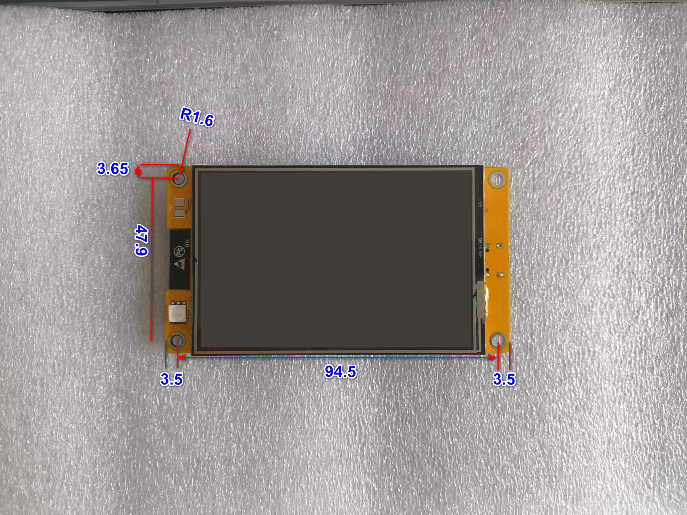
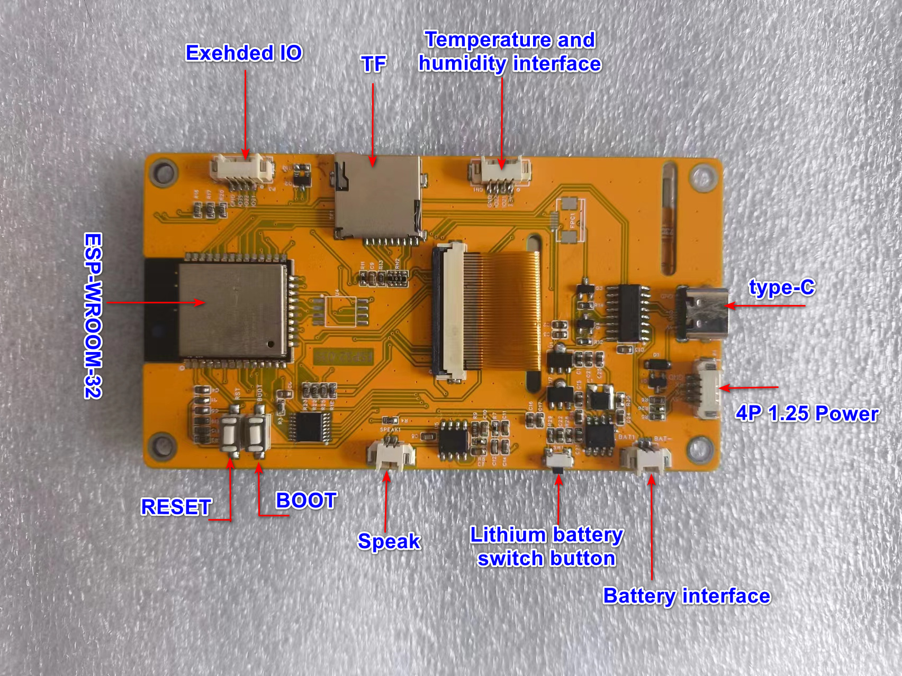
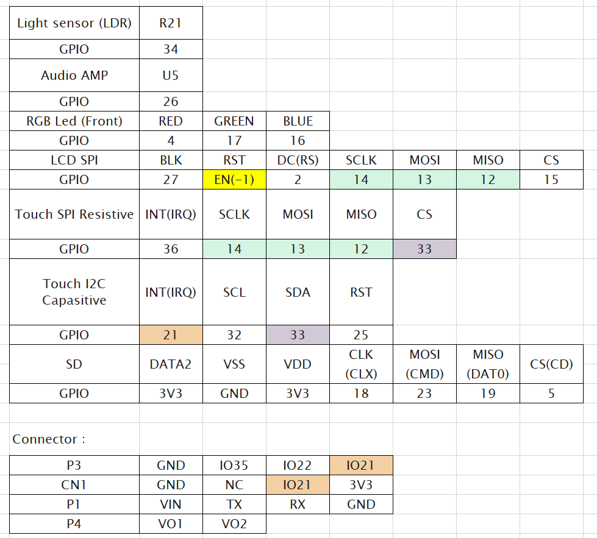

This repo contains documents for Cheap Yellow Display 3.5inch type C version with:
- MCU: ESP32-WROOM-32 dual-core MCU, integrated WI-FI and Bluetooth functions, 240MHz, 520KB SRAM, 448KB ROM, 4MB Flash
- 3.5 inch TFT Screen, support 16 BIT RGB 65K color display (ST7796 driver)
- Resistive Touch (XPT2046)
- Resolution 320x480
- TF Micro SD card slot
- Supports lithium battery power supply, supports both charging and discharging, and has over charging and over discharging protection (FM5324HJ1)

## GPIO Pinout

### Add-ons

[This page](https://github.com/witnessmenow/ESP32-Cheap-Yellow-Display/blob/main/ADDONS.md) contains information about additional hardware add-ons that can add functionality to your CYD

### Troubleshooting

[This page](https://github.com/witnessmenow/ESP32-Cheap-Yellow-Display/blob/main/TROUBLESHOOTING.md) contains information about how to troubleshoot your CYD device

### Hardware Mods

[This page](https://github.com/witnessmenow/ESP32-Cheap-Yellow-Display/blob/main/Mods/README.md) contains information about some hardware mods that can be performed on the CYD to improve or change some of its functionality

### Hardware Mods - Change ESP32-WROOM to ESP32-S3-WROOM-1 N16R8
[This page](https://macsbug.wordpress.com/2025/10/23/modified-esp32-3248s035r-to-esp32-s3/) contains information about replacing the ESP32 chip with more powerful ESP32-S3 with 8MB PSRAM & 16MB Flash

## License Info

This project is licensed as MIT as per the [license file](/LICENSE)

The one exception to this is the [Factory_files](/Factory_files/) folder, that I do not have the right to license

The PDF PCB layout of the MicroUSB version (Docs/esp32-3248s035r_pcb_layout-5.pdf) from this link: https://macsbug.wordpress.com/2022/10/02/esp32-3248s035/